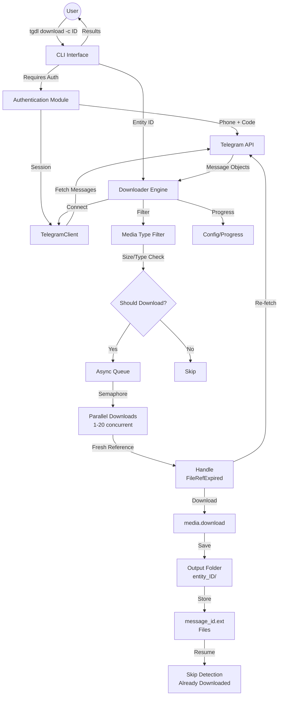

# 🚀 Telegram Media Downloader - tgdl

<div align="center">
  <p>
    


[](https://badge.fury.io/py/tgdl)
[](https://pypi.org/project/tgdl/)


  </p>
</div>

A powerful, high-performance CLI tool for downloading media from Telegram channels, groups, bot chats, and messages. Built with async/await for **5-10x faster** downloads with smart filters and progress tracking.


## ✨ Features

- ⚡ **Blazing Fast** - Parallel async downloads (5-10x faster than traditional tools)
- 🎯 **Smart Filters** - Download by media type (photos, videos, audio, documents)
- 📏 **Size Control** - Filter by file size (min/max)
- 🔄 **Auto-Resume** - Automatically skips already downloaded files
- 📊 **Progress Bars** - Real-time progress with download statistics
- 💾 **Session Management** - Secure login with saved sessions
- 🛡️ **Error Handling** - Graceful error recovery and interruption handling
- ⚙️ **Configurable** - Customize parallel downloads and output directories
- 🎨 **User-Friendly** - Beautiful CLI interface with colors and emojis

## 📦 Installation

### From PyPI (Recommended)

```bash
pip install tgdl
```

### From Source

```bash
git clone https://github.com/kavidu-dilhara/tgdl.git
cd tgdl
pip install -e .
```


## 🚀 Quick Start

### 1. Get API Credentials

Get your Telegram API credentials from [https://my.telegram.org/apps](https://my.telegram.org/apps)

### 2. Login

```bash
tgdl login
```

Enter your API ID, API Hash, and phone number when prompted.

### 3. List Your Channels/Groups/Bots

```bash
# List all channels
tgdl channels

# List all groups
tgdl groups

# List all bot chats
tgdl bots
```

### 4. Download Media

```bash
# Download all media from a channel
tgdl download -c CHANNEL_ID

# Download only photos and videos
tgdl download -c CHANNEL_ID -p -v

# Download from a bot chat
tgdl download -b BOT_ID -d

# Download with file size limit
tgdl download -g GROUP_ID --max-size 100MB

# Download from a message link
tgdl download-link https://t.me/channel/123
```

## 🏗 System Architecture



### How It Works

1. **User Input** → CLI command with channel/group ID
2. **Authentication** → Phone verification via Telegram API
3. **Message Fetching** → Retrieve all messages from entity
4. **Filtering** → Apply media type, size, and format filters
5. **Parallel Downloads** → Async concurrent downloads with semaphore control
6. **Error Handling** → Automatic recovery from FileReferenceExpiredError
7. **File Saving** → Deterministic naming (message_id.extension)
8. **Resume Detection** → Skip already-downloaded files on retry
9. **Progress Tracking** → Save state for interrupted downloads

## 📖 Usage

### Commands

#### `tgdl login`
Login to Telegram and save session.

```bash
tgdl login
```

#### `tgdl channels`
List all channels you're a member of.

```bash
tgdl channels
```

#### `tgdl groups`
List all groups you're a member of.

```bash
tgdl groups
```

#### `tgdl bots`
List all bot chats.

```bash
tgdl bots
```

#### `tgdl download`
Download media from a channel, group, or bot chat with filters.

```bash
tgdl download [OPTIONS]

Options:
  -c, --channel INTEGER       Channel ID to download from
  -g, --group INTEGER         Group ID to download from
  -b, --bot INTEGER           Bot chat ID to download from
  -p, --photos               Download only photos
  -v, --videos               Download only videos
  -a, --audio                Download only audio files
  -d, --documents            Download only documents
  --max-size TEXT            Maximum file size (e.g., 100MB, 1GB)
  --min-size TEXT            Minimum file size (e.g., 1MB, 10KB)
  --limit INTEGER            Maximum number of files to download
  --concurrent INTEGER       Number of parallel downloads (default: 5)
  -o, --output TEXT          Output directory (default: downloads)
  -h, --help                 Show this message and exit
```

#### `tgdl download-link`
Download media from a single message link.

```bash
tgdl download-link LINK [OPTIONS]

Options:
  -p, --photos               Accept only photos
  -v, --videos               Accept only videos
  -a, --audio                Accept only audio files
  -d, --documents            Accept only documents
  --max-size TEXT            Maximum file size
  --min-size TEXT            Minimum file size
  -o, --output TEXT          Output directory
  -h, --help                 Show this message and exit
```

#### `tgdl status`
Check authentication status and configuration.

```bash
tgdl status
```

Shows:
- Authentication status
- User information (name, ID, username)
- Config file locations
- API credentials (masked)

#### `tgdl logout`
Logout from Telegram and remove session.

```bash
tgdl logout
```

This will:
- Remove your local session file
- Delete stored API credentials
- Optionally clear download progress

#### `tgdl --version`
Show version information.

```bash
tgdl --version
```


## 📁 File Organization

Downloaded files are organized as follows:

```
downloads/
├── entity_1234567890/          # Channel/Group ID
│   ├── file1.jpg
│   ├── file2.mp4
│   └── ...
└── single_downloads/            # Files from download-link
    ├── video.mp4
    └── ...
```

## ⚙️ Configuration

Configuration is stored in `~/.tgdl/`:

- `config.json` - API credentials and settings
- `tgdl.session` - Telegram session (encrypted)
- `progress.json` - Download progress tracker

## 🎯 Requirements

- Python 3.7 or higher
- Active Telegram account
- Telegram API credentials (API ID & API Hash from [https://my.telegram.org/apps](https://my.telegram.org/apps))

## 🚀 Performance

- **5-10x faster** than traditional downloaders
- **Parallel downloads** with configurable concurrency
- **Smart caching** - skips already downloaded files
- **Optimized I/O** - async operations throughout

### Benchmarks

| Files | Sequential | tgdl | Speed Up |
|-------|-----------|------|----------|
| 10    | ~5 min    | ~1 min | 5x |
| 100   | ~45 min   | ~8 min | 5.6x |
| 1000  | ~7.5 hrs  | ~1.3 hrs | 5.8x |

*Results vary based on internet speed and file sizes*

## 🛠️ Troubleshooting

### Rate Limiting
If you get rate limited by Telegram, reduce concurrency:
```bash
tgdl download -c CHANNEL_ID --concurrent 2
```

### Authentication Issues
If you have authentication problems:
```bash
# Check status
tgdl status

# Login again
tgdl login
```

### Session Expired
Delete session and login again:
```bash
# On Linux/Mac
rm ~/.tgdl/tgdl.session

# On Windows
del %USERPROFILE%\.tgdl\tgdl.session

# Then login
tgdl login
```

## 🎨 Screenshots

```
$ tgdl download -c 1234567890 -p -v

📥 Download Settings
  Entity: Channel 1234567890
  Media types: photo, video
  Parallel downloads: 5
  Output: downloads

Found 123 already downloaded files, skipping...
Fetching messages from entity 1234567890...
Found 45 media files to download

Downloading: 100%|████████████████| 45/45 [02:15<00:00, 3.33file/s]

✓ Successfully downloaded 45 files!
Files saved to: downloads/entity_1234567890

🎉 Download complete! 45 files downloaded.
```

## � Advanced Usage

### Media Type Filters

Combine multiple media type filters:
```bash
# Photos and videos only
tgdl download -c 1234567890 -p -v

# Only documents
tgdl download -c 1234567890 -d

# Only audio files
tgdl download -c 1234567890 -a
```

### File Size Filters

Control file sizes:
```bash
# Download files between 1MB and 100MB
tgdl download -c 1234567890 --min-size 1MB --max-size 100MB

# Only large files (>50MB)
tgdl download -c 1234567890 --min-size 50MB

# Only small files (<10MB)
tgdl download -c 1234567890 --max-size 10MB
```

### Limit Number of Files

```bash
# Download only first 10 files
tgdl download -c 1234567890 --limit 10

# Download first 100 videos
tgdl download -c 1234567890 -v --limit 100
```

### Custom Output Directory

```bash
# Save to custom directory
tgdl download -c 1234567890 -o /path/to/downloads

# Use relative path
tgdl download -c 1234567890 -o ./my_downloads
```

### Performance Tuning

```bash
# Slow but safe (good for rate limits)
tgdl download -c 1234567890 --concurrent 2

# Balanced (default)
tgdl download -c 1234567890 --concurrent 5

# Fast (if you have good internet)
tgdl download -c 1234567890 --concurrent 10
```

## 🔐 Security & Privacy

- API credentials stored securely in `~/.tgdl/config.json`
- Session file encrypted by Telethon
- No data sent to third parties
- All downloads happen directly from Telegram servers

## 🤝 Contributing

Contributions are welcome! Please feel free to submit a Pull Request.

1. Fork the repository
2. Create your feature branch (`git checkout -b feature/AmazingFeature`)
3. Commit your changes (`git commit -m 'Add some AmazingFeature'`)
4. Push to the branch (`git push origin feature/AmazingFeature`)
5. Open a Pull Request

## 📄 License

This project is licensed under the MIT License - see the [LICENSE](LICENSE) file for details.

## ⚠️ Disclaimer

This tool is for personal use only. Please respect:
- Telegram's Terms of Service
- Copyright laws
- Content creators' rights
- Rate limits and server resources

## 🔗 Links

- [📚 Documentation](https://kavidu-dilhara.github.io/tgdl/) - Complete guide and API reference
- [PyPI Package](https://pypi.org/project/tgdl/)
- [GitHub Repository](https://github.com/kavidu-dilhara/tgdl)
- [Issue Tracker](https://github.com/kavidu-dilhara/tgdl/issues)
- [Telegram API Documentation](https://core.telegram.org/api)
- [Telethon Documentation](https://docs.telethon.dev/)

## 💬 Support

If you have questions or need help:
- Open an issue on [GitHub](https://github.com/kavidu-dilhara/tgdl/issues)
- Check existing issues for solutions

---

**Made with ❤️ by kavidu-dilhara**

**Happy Downloading! 🎉**

